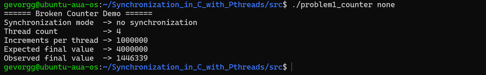
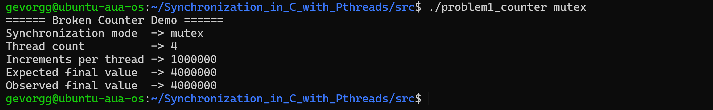
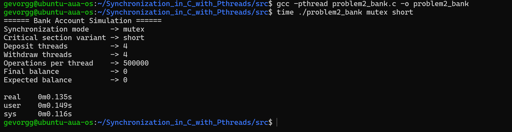
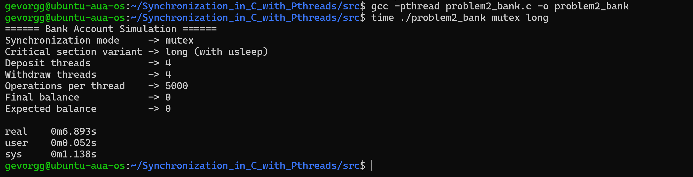
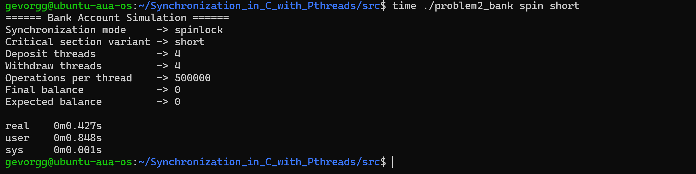
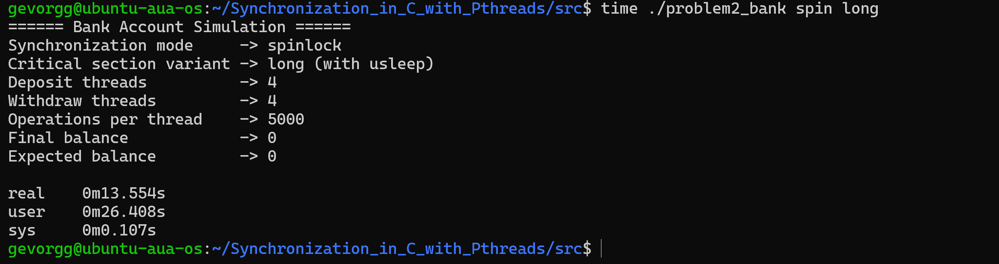
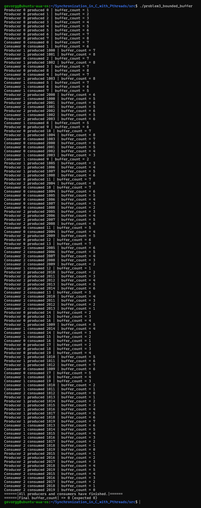
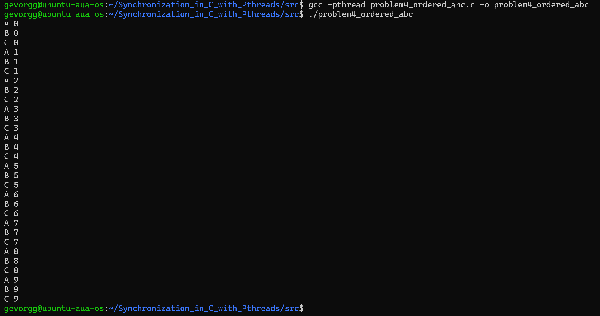
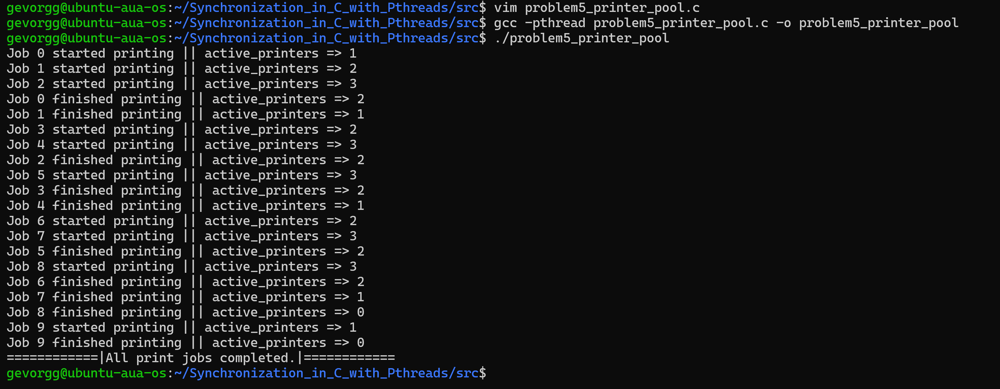

# Synchronization with POSIX Threads

This repository contains solutions to an Operating Systems homework focused on multithreading and synchronization using POSIX threads, mutexes, spinlocks, and semaphores. Each of the five problems highlights a core synchronization concept through practical C programs. The repository follows a clean structure with dedicated folders for source code, reports, and output screenshots.

Repository link: [https://github.com/RealGevorgian/Synchronization_in_C_with_Pthreads.git](https://github.com/RealGevorgian/Synchronization_in_C_with_Pthreads.git)

---

## Project Structure

```
Synchronization_in_C_with_Pthreads/
├── README.md
│
├── screenshots/
│   ├── problem1_none_output.png
│   ├── problem1_mutex_output.png
│   ├── problem1_spin_output.png
│   │
│   ├── problem2_mutex_short.png
│   ├── problem2_mutex_long.png
│   ├── problem2_spin_short.png
│   ├── problem2_spin_long.png
│   │
│   ├── problem3_producer_consumer.png
│   │
│   ├── problem4_ordered_abc.png
│   │
│   └── problem5_printers_pool.png
│
├── reports/
│   ├── problem1_report.md
│   ├── problem2_report.md
│   ├── problem3_report.md
│   ├── problem4_report.md
│   └── problem5_report.md
│
└── src/
    ├── problem1_counter.c
    ├── problem2_bank.c
    ├── problem3_bounded_buffer.c
    ├── problem4_ordered_abc.c
    └── problem5_printer_pool.c
```

---

## Requirements

* Ubuntu Server or any Linux distribution with POSIX threads support
* GCC compiler
* pthread library
* POSIX semaphores (`#include <semaphore.h>`)

Build any problem using:

```
gcc -pthread source_file.c -o executable
```

---

## Problem Summaries & Output Examples

### Problem 1: Broken Counter (Race Conditions, Mutex, Spinlock)

A shared counter is incremented by multiple threads. Three approaches are used:

1. No synchronization
2. Mutex-based synchronization
3. Spinlock-based synchronization

This demonstrates the race condition in the unsynchronized version and how mutual exclusion resolves it.

**Example Outputs:**





---

### Problem 2: Bank Account (Mutex vs Spinlock, Short vs Long Critical Sections)

Deposit and withdrawal threads modify a shared balance. Two lock types (mutex and spinlock) and two critical-section lengths (short and long) are tested. Execution times highlight performance differences under contention.

**Example Outputs:**






---

### Problem 3: Bounded Buffer (Producer–Consumer)

Implements a fixed-size circular buffer shared between producers and consumers. Semaphores coordinate buffer availability, while a mutex protects shared indices and buffer state.

**Example Output:**



---

### Problem 4: Ordered Printing (A → B → C)

Three threads print in a strict sequence enforced using semaphores only. This ensures deterministic ordered execution without relying on timing or busy-waiting.

**Example Output:**



---

### Problem 5: Printer Pool (Counting Semaphore)

Simulates a pool of identical printers using a counting semaphore. Only a limited number of threads can print simultaneously, demonstrating controlled access to a finite resource.

**Example Output:**



---

## How to Compile

Compile any problem directly from the `src/` directory, for example:

```
gcc -pthread src/problem1_counter.c -o problem1_counter
./problem1_counter

gcc -pthread src/problem2_bank.c -o problem2_bank
./problem2_bank mutex short
```

If a Makefile is added later, instructions will be updated accordingly.

---

## Reports

Each problem has a corresponding Markdown report under the `reports/` directory. These include explanations, observations, and screenshots from the associated program runs.

---

## Notes

* All programs were verified on Ubuntu Server.
* Only legitimate POSIX synchronization mechanisms were used.
* Source code follows consistent formatting for readability.
* Output screenshots match the expected results for each problem.

---

## Author

Gevorg Gevorgyan

The implementations reflect a solid understanding of synchronization, multithreading, and concurrent program design.

